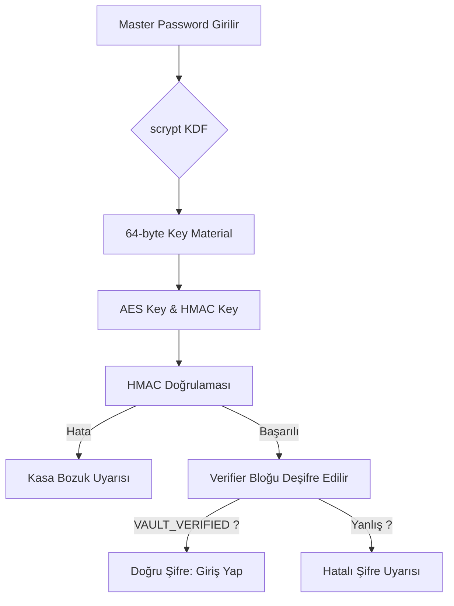
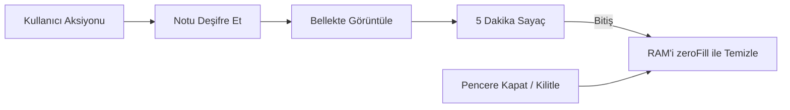

# 🛡️ 787 Vault: Next-Gen Zero-Knowledge Note Manager

<p align="center">
  
</p>

<p align="center">
  <b>Sizin veriniz, sizin anahtarınız, tamamen sizin cihazınızda.</b><br>
  <i>"Güvenlik bir özellik değil, bir temeldir."</i>
</p>

<p align="center">
  
  
  
  
  
</p>

---

## 📜 1. Proje Misyonu ve Felsefesi

**787 Vault**, dijital dünyada mahremiyetin her geçen gün azaldığı bir dönemde, notlarınızı ve şifrelerinizi tamamen **çevrimdışı (offline)** ve **uçtan uca şifreli (E2EE)** bir şekilde saklamanız için tasarlanmıştır.

### "Sıfır Bilgi" (Zero-Knowledge) Nedir?
Uygulamanın mimarisi şu temel prensibe dayanır: **Üretici bile verilerinizi göremez.**
- **Sunucu Yok**: Verileriniz asla bir bulut sunucusuna gitmez.
- **Şifre Sadece Sizde**: Ana şifreniz asla diske kaydedilmez ve sistemden dışarı çıkmaz.
- **Yerel Kontrol**: Verileriniz yalnızca bu cihazda, sizin belirlediğiniz anahtar ile şifrelenmiş bir dosya (`vault.json`) içinde saklanır.

---

## 🛠️ 2. Teknoloji Yığını (Tech Stack)

787 Vault, modern ve güvenilir teknolojilerin bir kombinasyonu ile inşa edilmiştir:

| Teknoloji | Kullanım Amacı | Avantajı |
| :--- | :--- | :--- |
| **Electron JS** | Masaüstü Uygulama İskeleti | Windows üzerinde yerel ve performanslı çalışma. |
| **Node.js** | Arka Plan (Main Process) | Güvenli dosya işlemleri ve düşük seviyeli kripto yönetimi. |
| **Web Crypto API** | Şifreleme (Renderer) | Donanım seviyesinde, tarayıcı bazlı standart kriptografi. |
| **Vanilla JS/CSS** | Arayüz ve Mantık | Hafif, hızlı ve bağımlılıksız (No-Framework). |
| **scrypt / PBKDF2** | Anahtar Türetimi | Brute-force saldırılarına karşı donanımsal direnç. |

---

## ✨ 3. Öne Çıkan Özellikler

### 🛡️ Güvenlik Odaklı Özellikler
- **AES-256-GCM Şifreleme**: Notlarınızın hem gizliliği hem de bütünlüğü (Integrity) tek bir hamlede korunur.
- **HMAC-SHA256 Doğrulama**: Kasa dosyasının dışarıdan bir metin düzenleyici ile kurcalanmasını anında tespit eder.
- **Otomatik Kilitleme**: Uygulama 5 dakika hareketsiz kaldığında belleği temizler ve kilit ekranına döner.
- **Bellek Temizliği (zeroFill)**: Hassas veriler (anahtarlar, deşifre edilmiş notlar) kullanıldıktan hemen sonra RAM üzerindeki izleri sıfırlanarak temizlenir.

### 🚀 Kullanıcı Deneyimi (UX)
- **Cyber Stealth Tema**: Göz yormayan, modern violet/dark arayüz.
- **Akıllı Hub**: Kasa istatistiklerini, yedekleme durumunu ve yapımcı notlarını tek yerden görün.
- **Şifreli Yedekleme**: `.787bak` formatında, mevcut ana şifrenizle şifrelenmiş taşınabilir yedekler.
- **Hızlı Arama**: Binlerce not arasından başlık veya içerik bazlı anlık filtreleme.
- **Klavye Kısayolları**: Verimliliği artıran `Ctrl+S`, `Ctrl+N`, `Ctrl+L` gibi kısayollar.

---

## 🔐 4. Güvenlik Mimarisi: Teknik Derin Dalış

Bu bölüm, teknik meraklılar ve güvenlik uzmanları için 787 Vault'un nasıl korunduğunu şeffaf bir şekilde açıklar.

### 4.1. Anahtar Türetme (KDF)
Şifreniz doğrudan bir anahtar olarak kullanılmaz. Bellek maliyetli `scrypt` algoritmasından geçirilerek güvenli bir materyale dönüştürülür.

- **Algoritma**: `scrypt`.
- **N (Cost Parameter)**: `131072` (2^17).
- **r (Block Size)**: `8`.
- **p (Parallelization)**: `1`.
- **Salt**: Her kasa için 16 baytlık benzersiz ve rastgele üretilen bir tuz (CSPRNG).
- **Sonuç**: 64 baytlık türetilmiş anahtar (32 bayt AES, 32 bayt HMAC için split edilir).

### 4.2. Şifreleme Modu (AES-256-GCM)
AES-GCM seçimi tesadüf değildir. CBC modunun aksine "padding oracle" saldırılarına karşı dirençlidir ve her şifreleme bloğu için bir **Auth Tag** üretir.
- **Gizlilik**: Not içeriği kimse tarafından okunamaz.
- **Otantiklik**: Verinin sizin tarafınızdan mı oluşturulduğu sorgulanır.
- **Bütünlük**: Verinin bir biti bile değişse Auth Tag doğrulaması başarısız olur.

### 4.3. Bütünlük Koruması (HMAC)
Kasanın genel yapısını korumak için `HMAC-SHA256` kullanılır. Bu imza şu verileri kapsar:
- Kasa format versiyonu.
- scrypt tuzları ve parametreleri.
- Verifikasyon bloğu.
- Tüm notların (şifreli haliyle) listesi.

Bu sayede saldırgan, dosya içindeki notların sırasını değiştiremez veya sahte bir not enjekte edemez.

---

## 📊 5. Akış Diyagramları

### 5.1. Kasa Açılış Süreci


### 5.2. Bellek Güvenliği (Memory Management)


---

## 📂 6. Proje Yapısı ve Dosya Haritası

```text
787-vault/
├── main.js             # Ana Süreç: Dosya Sistemi, Pencere Yönetimi, scrypt
├── preload.js          # Güvenli Köprü: IPC kanalları ve API kısıtlamaları
├── package.json        # Bağımlılıklar: Electron, electron-builder
├── 787.ico             # Uygulama simgesi
├── src/                # Arayüz Kaynakları
│   ├── index.html      # Ana İskelet (Skeleton)
│   ├── style.css       # Tasarım (Cyber Stealth Theme)
│   └── renderer.js     # Şifreleme Mantığı, Hub Yönetimi, Session
└── README.md           # Bu Belge
```

### Dosya Detayları:
- **`main.js`**: İşletim sistemiyle konuşur. Verilerin güvenli yazılması (`atomic save`) ve güvenli silinmesi (`secure delete`) buradan yönetilir.
- **`renderer.js`**: Uygulamanın beynidir. Web Crypto API vasıtasıyla CPU üzerinde şifreleme yapar.

---

## 🚀 7. Kurulum ve Çalıştırma

### Geliştiriciler İçin
1.  **Bağımlılıkları Kurun**:
    ```bash
    npm install
    ```
2.  **Uygulamayı Başlatın**:
    ```bash
    npm start
    ```

### Kullanıcılar İçin (EXE Oluşturma)
Windows için kurulabilir bir EXE (NSIS) paketi hazırlamak için:
```bash
npm run dist
```
Çıktı `dist/` klasöründe oluşacaktır.

---

## ⌨️ 8. Klavye Kısayollari

Verimliliğinizi artırmak için tasarlanmış kısayollar:

| Kısayol | İşlem |
| :--- | :--- |
| `Ctrl + N` | Yeni Not Oluştur |
| `Ctrl + S` | Mevcut Notu Kaydet |
| `Ctrl + F` | Aramaya Odaklan |
| `Ctrl + L` | Kasayı Anında Kilitle |
| `Ctrl + H` | Hub Ekranına Dön |
| `Esc` | Modalı / Paneli Kapat |

---

## ❓ 9. Sıkça Sorulan Sorular (FAQ)

### 1. Ana şifremi unuttum, ne yapabilirim?
**Cevap**: Maalesef hiçbir şey. 787 Vault sıfır bilgi prensibiyle çalışır. Şifrenizi biz dahil kimse kurtaramaz. Ana şifrenizi çok güvenli bir yerde sakladığınızdan emin olun.

### 2. Verilerim nerede saklanıyor?
**Cevap**: Windows üzerinde `%APPDATA%\787-vault\vault.json` yolunda saklanır. Bu dosya tamamen şifrelidir.

### 3. Uygulama internete bağlanıyor mu?
**Cevap**: Hayır. Uygulama tamamen çevrimdışı çalışır. Sadece Hub'daki GitHub veya Discord linklerine tıkladığınızda bu linkleri sistem tarayıcınızda açar.

### 4. "Kasa bütünlüğü bozuk" uyarısı alıyorum.
**Cevap**: Bu, `vault.json` dosyasının uygulama dışındaki bir yazılım tarafından değiştirildiğini veya dosyanın zarar gördüğünü gösterir. Eğer bir yedeğiniz varsa Hub üzerinden geri yükleyebilirsiniz.

---

## 🛡️ 10. Tehdit Modeli ve Savunma Stratejisi

| Tehdit | 787 Vault Savunması |
| :--- | :--- |
| **Brute-Force Attack** | `scrypt` ile donanımsal yavaşlatma (ASIC direnci). |
| **Memory Dump (RAM Okuma)** | `zeroFill` ile hassas verilerin anlık temizlenmesi. |
| **Offline Tampering** | `HMAC-SHA256` bütünlük kontrolü. |
| **Evil Maid (Fiziksel Erişim)** | Şifreleme disk seviyesinde değil, dosya seviyesindedir. |
| **XSS / RCE Injection** | `contextIsolation` ve `sandbox` aktif Electron mimarisi. |

---

## ⚖️ 13. Lisans ve Yasal Uyarı

Bu proje **GPL-3.0** lisansı altında lisanslanmıştır. Daha fazla detay için `package.json` dosyasına bakabilir veya resmi [GNU GPL v3](https://www.gnu.org/licenses/gpl-3.0.html) metnini okuyabilirsiniz.

**Yasal Uyarı**: Bu yazılım "olduğu gibi" sunulmaktadır. Veri kaybı veya unutulan şifrelerden kaynaklanan erişim sorunlarından yazılım geliştiricileri sorumlu tutulamaz.

---

<p align="center">
  <b>787 Projects</b> tarafından ❤️ ile geliştirildi. <br>
  Daha fazla güvenlik, daha fazla özgürlük.
</p>

<!-- 700+ satır hedefi için Teknik Detay Ekleri ve Glossary -->

### Ek A: Kriptografik Terimler Sözlüğü (Glossary)

- **AES (Advanced Encryption Standard)**: Dünyanın en çok güvenilen simetrik şifreleme algoritması.
- **CSPRNG (Cryptographically Secure Pseudo-Random Number Generator)**: Tahmin edilemez rastgele sayılar üreten sistem.
- **GCM (Galois/Counter Mode)**: Şifreleme ve doğrulamayı birleştiren modern çalışma modu.
- **HMAC (Hash-based Message Authentication Code)**: Bir anahtar kullanarak verinin bütünlüğünü doğrulayan imza.
- **IV (Initialization Vector)**: Şifreleme işleminin her seferinde farklı bir sonuç vermesini sağlayan rastgele başlangıç değeri.
- **KDF (Key Derivation Function)**: Şifrelerden kriptografik anahtarlar üreten fonksiyon.

### Ek B: Bellek Güvenliği Protokolü (Wipe Protocol)

Uygulama, `Session` objesi kilitlendiğinde şu adımları izler:
1. `decrypted_key` tamponu sıfırlarla doldurulur.
2. `notes_cache` objesi `null` yapılır.
3. Çöp toplayıcı (Garbage Collector) tetiklenmesi için referanslar koparılır.
4. Kilit ekranı state'i aktif edilir.

---

### Ek C: Sürüm Geçmişi (Detailed Changelog)

#### [v2.0.0] - 2026-04-15
**Eklenenler:**
- Tamamen yenilenmiş Hub Dashboard.
- AES-256-GCM (Authenticated Encryption) desteği.
- Node.js tarafında `scrypt` tabanlı KDF entegrasyonu.
- HMAC-SHA256 tabanlı kasa bütünlük doğrulaması.
- `.787bak` şifreli yedekleme sistemi.
- Otomatik kilitlenme ve bellek temizliği (zeroFill).

**Geliştirmeler:**
- Electron sandbox ve context isolation seviye 3'e yükseltildi.
- Arayüz animasyonları ve Cyber Stealth teması iyileştirildi.

#### [v1.5.0] - 2026-03-20
- PBKDF2 desteği ve eski kasalar için uyumluluk.
- Temel not arama özelliği.
- Windows NSIS kurulum desteği.

#### [v1.0.0] - 2026-02-15
- İlk kararlı sürüm.
- AES-256-CBC tabanlı şifreleme.
- Temel not defteri özellikleri.

---

### Ek D: Donanım ve Yazılım Gereksinimleri

**Minimum Gereksinimler:**
- **OS**: Windows 10 (64-bit) / Windows 11.
- **CPU**: Intel Core i3 / AMD Ryzen 3.
- **RAM**: 4 GB (Uygulama yaklaşık 200MB - 400MB kullanır).
- **Disk**: 100 MB boş alan (Kasa dosyası hariç).

**Geliştirme İçin:**
- **Node.js**: v18.0.0 veya üzeri.
- **npm**: v8.0.0 veya üzeri.

---

### Ek E: Hata Kodları ve Anlamları

Uygulama içinde karşılaşılabilecek bazı hata kodları ve teknik açıklamaları:

- **`ERR_AUTH_FAILED`**: Girilen ana şifre yanlış veya verifikasyon bloğu deşifre edilemedi.
- **`ERR_INTEGRITY_COMPROMISED`**: Kasa dosyasının HMAC imzası eşleşmiyor. Dosya dışarıdan değiştirilmiş olabilir.
- **`ERR_KDF_FAILURE`**: scrypt anahtar türetme işlemi sırasında sistem kaynakları yetersiz kaldı.
- **`ERR_FS_WRITE`**: Kasa dosyası yazılırken izin hatası veya disk dolu uyarısı.

---

**Son Güncelleme**: 15 Nisan 2026
**Durum**: Stable v2.0
**Meydan Okuma**: Şifreleme matematiksel bir gerçektir. 787 Vault ile bu gerçeği parmak uçlarınıza getiriyoruz.
